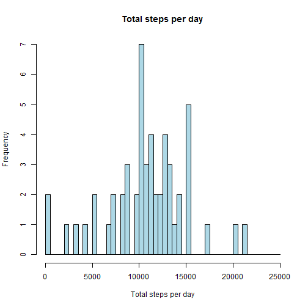
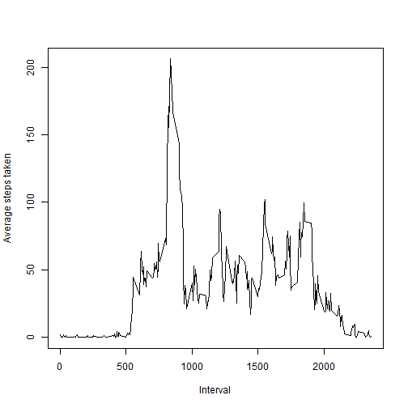
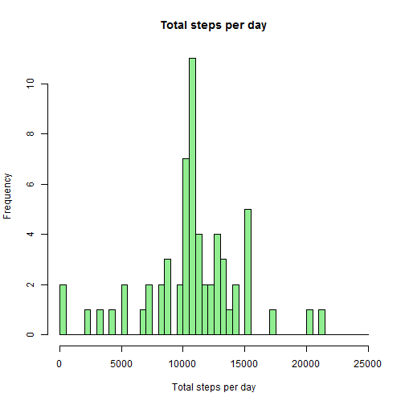
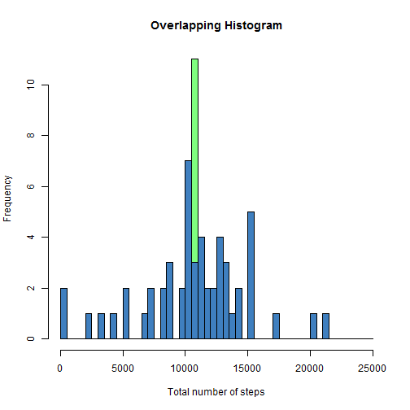
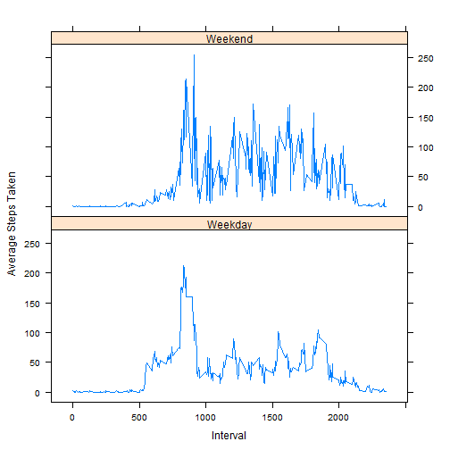

  
  

# Loading and preprocessing the data

```r
# Load Data after extracting csv file
activity <- read.csv(unzip("activity.zip","activity.csv"),header=TRUE)

# Convert date column from factor to Date type
library(lubridate)
activity$date2 <- as.Date(as.character(activity$date),"%Y-%m-%d") # convert date field to Date type
activity_noNA <- activity[!is.na(activity$steps),] # data set excluding missing step values
activity_NA <- activity[is.na(activity$steps),]    # dataset of missing step values
```

# Mean total number of steps taken per day:


```r
library(plyr)
library(dplyr)
# Calculate Average and Total steps taken daily      
summ <- ddply(activity_noNA,.(date),summarize, TotalSteps = sum(steps,na.rm=TRUE),AvgS = mean(steps,na.rm=TRUE))
```

Histogram of the total number of steps taken each day

```r
hist(summ$TotalSteps, xlab ="Total steps per day",main = "Total steps per day",
      breaks = seq(0,25000, by = 500), col = "light blue")
```

 

Mean and median of the total number of steps taken per day:

```r
# Mean steps taken per day
mean(summ$TotalSteps)
```

```
## [1] 10766.19
```

```r
# Median of steps taken per day
median(summ$TotalSteps)
```

```
## [1] 10765
```
  

# Average daily activity pattern

```r
# average number of steps taken (averaged across all days) by the 5-minute intervals
summ2 <- ddply(activity_noNA,.(interval),
              summarize,
              totalby_int = sum(steps,na.rm=TRUE),
              avgsby_int = mean(steps,na.rm=TRUE))
#Timeseries plot average steps vs intervals
plot(summ2$interval,summ2$avgsby_int, type="l",xlab="Interval",ylab="Average steps taken")
```

 

```r
# Interval for which average value is maximum
maxinterval <- summ2[order(summ2$avgsby_int,decreasing=TRUE),][1,1]
```

Of all the 5-minute intervals, the 835th interval has, on average, the maximum number of steps.  


# Imputing missing values


```r
totalna <- sum(is.na(activity$steps))
```
Total number of values missing from the dataset are 2304. For further analysis  
let them be replaced with 5-minute interval averages.

In the code below, for the rows with missing data the 5-minute interval averages, from the summ2 dataset above, replace the NAs.
summ2 dataset contains average number of steps taken (averaged across all days) by the 5-minute intervals

```r
activity_new <- activity
ind <- which(is.na(activity$steps),arr.ind=TRUE) # indices for which data is missing
for (i in ind){
    for (j in 1:dim(summ2)[1]){                  # for each missing data row
        if (activity_new[i,3] == summ2[j,1]){    # the corresponding 5-minute interval from summ2
            activity_new[i,1] <- summ2[j,3]      # provides the average value
            next;
        }
    }
}
summ_new <- ddply(activity_new,.(date),summarize,totalby_int = sum(steps)) # Calculate total steps by date after imputing
```


## Histogram of the total number of steps taken each day imputing the missing values with averages

```r
hist(summ_new$totalby_int, xlab ="Total steps per day",main = "Total steps per day"
     ,     breaks = seq(0,25000, by = 500), col = "light green")
```

 

The mean and median total number of steps taken per day:

```r
# The new Mean
mean(summ_new$totalby_int)
```

```
## [1] 10766.19
```

```r
# The new Median
median(summ_new$totalby_int)
```

```
## [1] 10766.19
```

Since the missing values were replaced with averages, the average number of steps does not change but the median now changes.
As you can see below (in the histograms of missing dataset in blue overlapped with imputed dataset in green) that the dates filled with new values now moved right to the center of the distribution, consequently changing the median value


```r
hist(summ_new$totalby_int, col=rgb(0,1,0,alpha=0.5), main="Overlapping Histogram",xlab = "Total number of steps", breaks = seq(0,25000,by=500))
hist(summ$TotalSteps, col=rgb(0,0,1,alpha=0.5),  breaks = seq(0,25000,by=500),add=T)
```

 

# Differences in activity patterns between weekdays and weekends:
As can be seen in the plots below, the weekend activity is more on an average than on weekdays.


```r
activity_new$factor.weekday <- as.factor(ifelse(weekdays(activity_new$date2)==c("Sunday","Saturday"),"Weekend","Weekday"))

summ_new_avg <- ddply(activity_new,.(factor.weekday,interval),summarize,AvgSteps_new = mean(steps))

library(lattice)
xyplot(AvgSteps_new~interval|factor.weekday,data=summ_new_avg, type="a", xlab="Interval",ylab="Average Steps Taken",layout=c(1,2))
```

 
